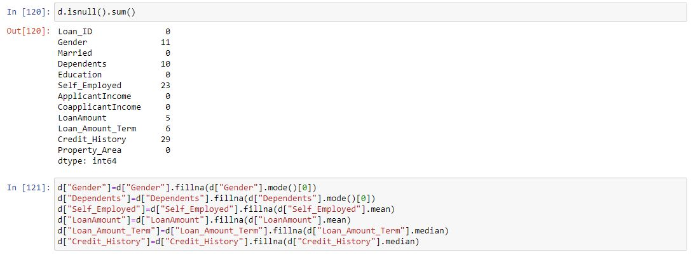

# Ex-01_DS_Data_Cleansing
# AIM
To read the given data and perform data cleaning and save the cleaned data to a file.

# Explanation
```
    Data cleaning is the process of preparing data for analysis by removing or modifying data that is incorrect ,incompleted , irrelevant , duplicated or improperly formatted. Data cleaning is not simply about erasing data ,but rather finding a way to maximize datasets accuracy without necessarily deleting the information.
```

# ALGORITHM
## STEP 1
Read the given Data

## STEP 2
Get the information about the data

## STEP 3
Remove the null values from the data

## STEP 4
Save the Clean data to the file

# CODE AND OUTPUT
~~~
NAME                 :  Venkatesh E
REGISTER NUMBER      :  212221230119
~~~
## CODE-1
~~~python
import pandas as pd
d = pd.read_csv('Data_set.csv')

d.head()
d.info()
d.isnull().sum()

d['show_name']=d['show_name'].fillna(d['show_name'].mode()[0])
d['aired_on']=d['aired_on'].fillna(d['aired_on'].mode()[0])
d['original_network']=d['original_network'].fillna(d['original_network'].mode()[0])
d['rating']=d['rating'].fillna(d['rating'].mean())
d['current_overall_rank']=d['current_overall_rank'].fillna(d['current_overall_rank'].mean())
d['watchers']=d['watchers'].fillna(d['watchers'].median())

d.info()
d.isnull().sum()
~~~
## OUPUT-1


## CODE-2
~~~python
import pandas as pd
d=pd.read_csv("Loan_data.csv")

d.head()
d.info()
d.isnull().sum()

d["Gender"]=d["Gender"].fillna(d["Gender"].mode()[0])
d["Dependents"]=d["Dependents"].fillna(d["Dependents"].mode()[0])
d["Self_Employed"]=d["Self_Employed"].fillna(d["Self_Employed"].mode()[0])
d["LoanAmount"]=d["LoanAmount"].fillna(d["LoanAmount"].mode()[0])
d["Loan_Amount_Term"]=d["Loan_Amount_Term"].fillna(d["Loan_Amount_Term"].mode()[0])
d["Credit_History"]=d["Credit_History"].fillna(d["Credit_History"].mode()[0])

d.info()
d.isnull().sum()
~~~
## OUPUT-2





# Result
Thus the given data is read , cleaned and the cleaned data is saved into the file.

